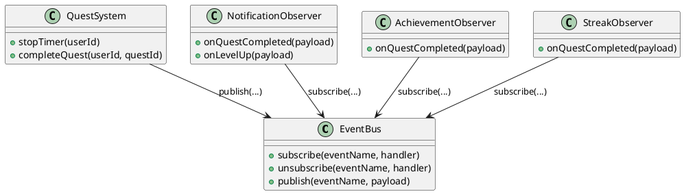
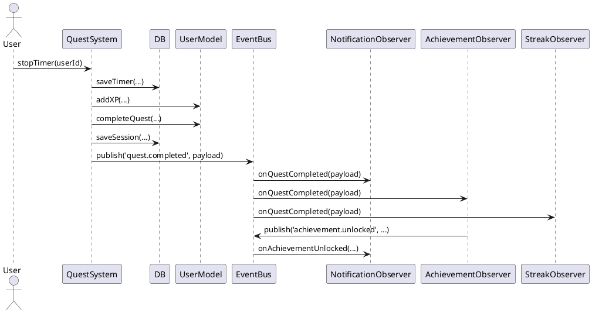

# Entwurfsmuster: Observer (Publish/Subscribe) – StudyQuest

**Titel des Dokuments:**  
Oberserver (Publish/Subscribe) – StudyQuest

**Projektname:**  
StudyQuest – Gamifizierte Lern- und Notenverwaltungs-Web-App

**Modul:**  
Software Engineering I – Praxis

**Projektzeitraum:**  
Wintersemester 2025 / 2026

**Version:**  
1.2

**Datum:**  
26.02.2026

**Author:innen:**  
- Michael Steer (Scrum Master)  
- Luke Engehardt (Product Owner)  
- Giuliana Carrano (Developer)  
- Paul Strasser (Developer)  
- Roman Faber (Developer)

**Betreuer / Prüfer:**  
Sascha Wanninger

**Freigabe durch autorisierte Person:**  
Michael Steer (Scrum Master)

---

## Changelog

| **Version** | **Datum** | **Autor** | **Änderungsbeschreibung** |
| --- | --- | --- | --- |
| 1.0 | 30.01.2026 | L. Engelhardt | Erstfassung |
| 1.1 | 10.02.2026 | M. Steer  | Überarbeitung passend zu v1.0 |
| 1.2. | 26.02.2026 | M. Steer | Finalversion zur Abgabe vorbereitet | 

## Distribution List

| **Name**          | **Rolle**             | **Kommentar / Zuständigkeit**                 |
|--------------------|-----------------------|-----------------------------------------------|
| Sascha Wanninger   | Prüfer / Betreuer     | Bewertung im Rahmen des Moduls                |
| Michael Steer      | Scrum Master          | Koordination & Freigabe                       |
| Luke Engehardt     | Product Owner         | Anforderungen, Dokumentation & Technische Dokumentation                  |
| Giuliana Carrano   | Developer             | Projektskizze, Dokumentation, Architektur & UML                   |
| Paul Strasser      | Developer             |                      |
| Roman Faber        | Developer             |                            |


**Status: Architektur-Konzept für zukünftige Verbesserung (v1.0: Nicht implementiert)**

## 1. Ziel
Die Quest-Logik soll fachlich bleiben (XP berechnen, Quest abschließen). Nebenwirkungen wie Notifications, Achievements und Streaks sollen entkoppelt werden. Neue Reaktionen auf ein Ereignis (z. B. Telemetrie, zusätzliche Badges, UI-Refresh) sollen ohne Änderung am Quest-Modul möglich sein.

## 2. Aktuelle Implementierung (v1.0)
Die aktuelle Version nutzt direkte Methodenaufrufe, nicht das hier dokumentierte Observer-Pattern:

In `src/js/quest.js` (Zeilen 115-140) werden nach `stopTimer()` folgende Operationen direkt aufgerufen:
```javascript
// Direkte Aufrufe (keine EventBus-Vermittlung)
NotificationModel.notifyQuestCompleted(...);
NotificationModel.notifyLevelUp(...);
AchievementSystem.checkAndUnlock(...);
NotificationModel.notifyAchievementUnlocked(...);  // Multiple Aufrufe
UserModel.updateStreak(...);
```

Dies bedeutet:
- ✓ **Funktional korrekt** – Alle Nebenwirkungen werden korrekt ausgelöst
- ✗ **Starke Kopplung** – `QuestSystem` kennt `NotificationModel`, `AchievementSystem` und `UserModel` direkt
- ✗ **Erweiterbarkeit** – Neue Reaktionen erfordern Code-Änderungen im `quest.js`

## 2.1 Warum nicht v1.0 implementiert?
Das Observer-Pattern hätte folgende Anforderungen:
- Eine `EventBus`-Instanz (`eventBus.js`)
- Registrierung aller Observer in `app.js` beim Start
- Asynchrone Event-Verarbeitung (könnten Race Conditions entstehen?)
- Für den MVP-Scope nicht prioritär, da direkte Aufrufe ausreichen

## 3. Pattern-Kurzbeschreibung
**Observer** beschreibt eine 1:n-Beziehung: Ein Publisher (Subject) veröffentlicht Zustandsänderungen/Ereignisse, mehrere Subscriber (Observer) reagieren darauf. In Web-Apps wird das oft als **Publish/Subscribe** umgesetzt (EventBus).

## 4. Proposed Architecture (zukünftige Verbesserung)

### 4.1 Rollen
- **Publisher/Subject:** `QuestSystem` (und perspektivisch weitere fachliche Module)
- **EventBus:** zentrale Instanz `EventBus` mit `subscribe()` und `publish()`
- **Observer:** kleine Komponenten/Funktionen, die jeweils genau eine Reaktion kapseln

### 4.2 Beispiel-Events
- `quest.completed` (Quest wurde erfolgreich abgeschlossen)
- `user.levelUp` (Level-Up ist passiert)
- `achievement.unlocked` (Achievement wurde freigeschaltet)

### 4.3 Beispiel-Payload (Schema)
- `quest.completed`: `{ userId, questId, xpEarned, timeBonus, durationSec, timestamp }`
- `user.levelUp`: `{ userId, newLevel, timestamp }`
- `achievement.unlocked`: `{ userId, achievementId, title, timestamp }`

### 4.4 Beispiel-Observer
- **NotificationObserver**: erstellt Notifications über `NotificationModel.*`
- **AchievementObserver**: triggert `AchievementSystem.checkAndUnlock()` und publisht pro Treffer `achievement.unlocked`
- **StreakObserver**: ruft `UserModel.updateStreak()` und publisht optional `streak.updated`

## 5. Proposed UML Architecture (zukünftige Verbesserung)
### 5.1 Klassendiagramm


### 5.2 Sequenzdiagramm (Timer stoppen)


## 6. Umsetzungsvorschlag für Refactor (nicht v1.0)

1. `eventBus.js` einführen (kleines Objekt mit interner Map `event -> [handler]`).
2. Observer in `app.init()` registrieren (z. B. `EventBus.subscribe('quest.completed', NotificationObserver.onQuestCompleted)`).
3. In `quest.js` die direkten Aufrufe (Notification/Achievement/Streak) durch `EventBus.publish(...)` ersetzen.
4. Event-Namen als Konstanten definieren, um Tippfehler zu vermeiden.
5. **Testing:** Isolierte Unit-Tests für jeden Observer möglich (keine Abhängigkeiten zu anderen Modulen).

## 7. Nutzen des Refactors (zukünftig)
**Mit EventBus-Implementierung würde gelten:**
- ✓ Klare Verantwortlichkeiten (jeder Observer eine Funktion)
- ✓ Weniger Kopplung (`quest.js` kennt EventBus, nicht die Observer direkt)
- ✓ Erweiterungen ohne Seiteneffekte (neue Observer hinzufügen ohne quest.js zu ändern)
- ✓ Bessere Testbarkeit (Observer isoliert testbar)

**Trade-offs des Refactors:**
- ✗ Kontrollfluss wird „indirekter" (Debugging schwieriger)
- ✗ Event-Reihenfolge muss bewusst festgelegt werden
- ✗ Gefahr von vergessenen `unsubscribe()` (Speicher-Leaks) bei dynamischem Registrieren


## 8. Abnahmekriterien (zukünftige Implementierung)
- Es ist klar beschrieben, **welches** Ereignis der Publisher auslöst und **welche** Observer darauf reagieren.
- UML-Diagramme zeigen Teilnehmer und Ablauf (Klasse + Sequenz).
- Es ist ein Mapping auf die vorhandenen Module vorhanden (`quest.js`, `notification.js`, `achievement.js`, `user.js`).
- Die Vorteile und Grenzen sind kurz benannt.
- EventBus wird in `app.init()` initialisiert und alle Observer werden registriert.
- keine direkten Aufrufe zwischen Modulen mehr, nur EventBus-Publish/Subscribe.

## 9. Abnahmekriterien v1.0 (aktuelle Implementierung)
✓ Direktes Modulzugriffsmuster der aktuellen Architektur funktioniert korrekt  
✓ Alle Nebenwirkungen (Notifications, Achievements, Streaks) werden nach Quest-Ende ausgelöst  
✓ Funktionale Anforderungen erfüllt, auch wenn nicht das Observer-Pattern verwendet wird  
✓ Dieses Dokument dient als Architektur-Verbesserungsvorschlag für spätere Versionen
