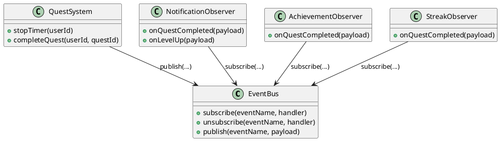
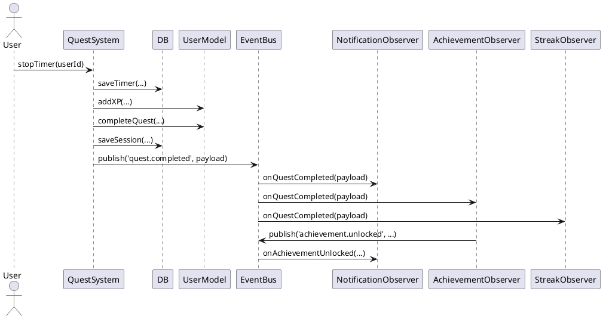

# Entwurfsmuster: Observer (Publish/Subscribe) – StudyQuest

## 1. Ziel
Die Quest-Logik soll fachlich bleiben (XP berechnen, Quest abschließen). Nebenwirkungen wie Notifications, Achievements und Streaks sollen entkoppelt werden. Neue Reaktionen auf ein Ereignis (z. B. Telemetrie, zusätzliche Badges, UI-Refresh) sollen ohne Änderung am Quest-Modul möglich sein.

## 2. Ausgangssituation im Projekt
Aktuell werden in `src/js/quest.js` nach dem Stoppen eines Timers bzw. beim Abschließen einer Quest mehrere Folgeschritte direkt im gleichen Modul ausgeführt, z. B.:

- `NotificationModel.notifyQuestCompleted(...)` und `NotificationModel.notifyLevelUp(...)`
- `AchievementSystem.checkAndUnlock(...)` und danach weitere Notification-Aufrufe
- `UserModel.updateStreak(...)`

Damit kennt `QuestSystem` mehrere Subsysteme gleichzeitig. Das ist funktional ok, aber es koppelt die Module stark und macht spätere Erweiterungen und Tests unnötig aufwendig.

## 3. Pattern-Kurzbeschreibung
**Observer** beschreibt eine 1:n-Beziehung: Ein Publisher (Subject) veröffentlicht Zustandsänderungen/Ereignisse, mehrere Subscriber (Observer) reagieren darauf. In Web-Apps wird das oft als **Publish/Subscribe** umgesetzt (EventBus).

## 4. Mapping auf StudyQuest
### 4.1 Rollen
- **Publisher/Subject:** `QuestSystem` (und perspektivisch weitere fachliche Module)
- **EventBus:** zentrale Instanz `EventBus` mit `subscribe()` und `publish()`
- **Observer:** kleine Komponenten/Funktionen, die jeweils genau eine Reaktion kapseln

### 4.2 Beispiel-Events
- `quest.completed` (Quest wurde erfolgreich abgeschlossen)
- `user.levelUp` (Level-Up ist passiert)
- `achievement.unlocked` (Achievement wurde freigeschaltet)

### 4.3 Beispiel-Payload (Schema)
- `quest.completed`: `{ userId, questId, xpEarned, timeBonus, durationSec, timestamp }`
- `user.levelUp`: `{ userId, newLevel, timestamp }`
- `achievement.unlocked`: `{ userId, achievementId, title, timestamp }`

### 4.4 Beispiel-Observer
- **NotificationObserver**: erstellt Notifications über `NotificationModel.*`
- **AchievementObserver**: triggert `AchievementSystem.checkAndUnlock()` und publisht pro Treffer `achievement.unlocked`
- **StreakObserver**: ruft `UserModel.updateStreak()` und publisht optional `streak.updated`

## 5. UML (PlantUML)
### 5.1 Klassendiagramm

### 5.2 Sequenzdiagramm (Timer stoppen)

## 6. Umsetzungsvorschlag (ohne Code-Zwang)
1. `eventBus.js` einführen (kleines Objekt mit interner Map `event -> [handler]`).
2. Observer in `app.init()` registrieren (z. B. `EventBus.subscribe('quest.completed', NotificationObserver.onQuestCompleted)`).
3. In `quest.js` die direkten Aufrufe (Notification/Achievement/Streak) durch `EventBus.publish(...)` ersetzen.
4. Event-Namen als Konstanten definieren, um Tippfehler zu vermeiden.

## 7. Nutzen und Trade-offs
**Nutzen:** klare Verantwortlichkeiten, weniger Kopplung, Erweiterungen ohne Seiteneffekte, bessere Testbarkeit (Observer isoliert testbar).

**Trade-offs:** Kontrollfluss wird „indirekter“ (Debugging schwieriger), Event-Reihenfolge muss bewusst festgelegt werden, Gefahr von vergessenen `unsubscribe()` (Speicher/Handler-Leaks) bei dynamischem Registrieren.

## 8. Abnahmekriterien (Dokumentation)
- Es ist klar beschrieben, **welches** Ereignis der Publisher auslöst und **welche** Observer darauf reagieren.
- UML-Diagramme zeigen Teilnehmer und Ablauf (Klasse + Sequenz).
- Es ist ein Mapping auf die vorhandenen Module vorhanden (`quest.js`, `notification.js`, `achievement.js`, `user.js`).
- Die Vorteile und Grenzen sind kurz benannt.
